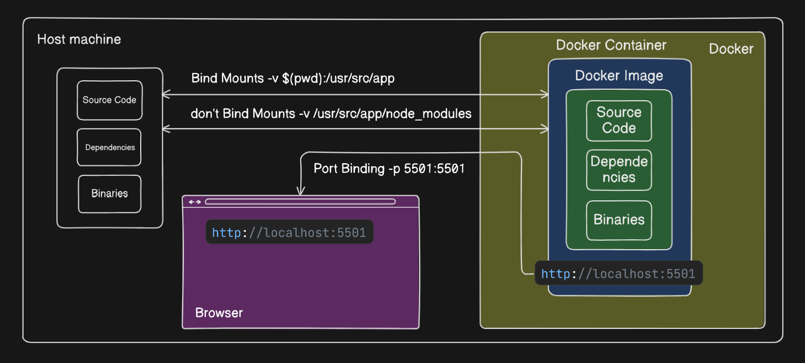

### Setup Nodejs Project Steps

#### Git Setup

-   Initialize empty git repository

```sh
git init
```

-   Create .gitignore file to avoid pushing uneccessary files
-   Install gitignore vs code extension by CodeZombie
-   Press ctrl + shift + p, type add gitignore
-   Type Node then select Node.gitignore
-   Create a remote repository on github.com
-   Setup remote repo into your local
-   Push current code to main repo

#### Node Version Manager setup

-   Install nvm tool
-   Link to install nvm on windows https://github.com/coreybutler/nvm-windows/releases
-   Check nvm version

```sh
nvm -v
```

-   Check available node versions list

```sh
nvm list available
```

-   Check installed node versions in your system

```sh
nvm ls
nvm list
```

-   Install LTS node version

```sh
nvm install lts
```

-   Install Latest node version

```sh
nvm install latest
```

-   Install Specific node version

```sh
nvm install version
```

-   Use Specific node version

```sh
nvm use version
```

-   Create .nvmrc file in the root dir of your project and define the node version to work with

```.nvmrc
v22.10.0
```

-   Install specified version defined in .nvmrc file

```sh
nvm use
```

#### Nodej project Setup

-   Initialize node project

```sh
npm init
```

-   It will create package.json file
-   Create src folder

#### Typescript setup

-   Install typescript as dev dependency in your peoject

```sh
npm i -D typescript
```

-   In node_modules/bin you will see **tsc** that is typescript compiler and **tscserver** which gives auto-completion
-   Install nodejs types

```sh
npm i -D @types/node
```

-   Compile ts file

```sh
npx tsc fileName
```

-   To configure typescript, generate tsconfig.json file

```sh
npx tsc --init
```

-   Specify rootDir and outDir in tsconfig.json file

```tsconfig.json
rootDir: "./src",
outDir: "./dist"
```

-   This makes tsc read tsconfig.json and compile all files according to the settings (including outDir).

```sh
npx tsc
```

#### Prettier setup

-   Install prettier https://prettier.io/docs/install as a dev dependency

```sh
npm install --save-dev --save-exact prettier@3.0.3
```

-   Create .prettierrc file and add some configuration

```.prettierrc
{
  "singleQuote": true,
  "semi": false,
  "tabWidth": 4
}
```

-   Create .prettierignore file. By default it ignores build and coverage however we have created dist so change it from build to dist.

```sh
node --eval "fs.writeFileSync('.prettierignore','# Ignore artifacts:\nbuild\ncoverage\n')"
```

-   Install prettier vs code extension
-   Create two scripts

```package.json
"format:fix": "prettier . --write",
"format:check": "prettier . --check",
```

#### ESlint setup

-   ESLint is a tool for identifying and fixing problems in your JavaScript code, essential for maintaining code quality and consistency.
-   Configure typescript eslint https://typescript-eslint.io/getting-started/legacy-eslint-setup/
-   Install eslint and types as a dev dependency

```sh
npm install --save-dev eslint @eslint/js typescript-eslint
```

-   Next, create an eslint.config.mjs config file in the root of your project, and populate it with the following:

```eslint.config.mjs
// @ts-check

import eslint from '@eslint/js';
import tseslint from 'typescript-eslint';

export default tseslint.config(
  eslint.configs.recommended,
  tseslint.configs.recommended,
);
```

-   To avoid conflicts between prettier and eslint install https://github.com/prettier/eslint-config-prettier

```sh
npm i -D eslint-config-prettier
```

-   Import and add config to eslint.cofnig.mjs file

```js
import eslintConfigPrettier from 'eslint-config-prettier/flat'
export default tseslint.config(someConfig, eslintConfigPrettier)
```

#### Git hooks / husky setup

-   Husky is a tool that makes Git hooks easy, used for automating tasks such as linting and testing on pre-commit or pre-push.

-   Install husky package

```sh
npm install --save-dev husky
```

-   The init command simplifies setting up husky in a project.

```sh
npx husky init
```

-   It creates a pre-commit script in .husky/ and updates the prepare script in package.json. Modifications can be made later to suit your workflow.
-   Integrate huskywith eslint https://github.com/lint-staged/lint-staged

```sh
npm install --save-dev lint-staged # requires further setup
```

-   Add this block of code into package.json file

```json
"lint-staged": {
        "*.ts": [
            "npm run lint:fix",
            "npm run format:fix"
        ]
    }
```

-   Add below command to pre-commit husky file

```bash
npx lint-staged
```

#### Application config setup

-   Create .env file to store sensitive information
-   Install dotenv package

```sh
npm install dotenv
```

-   Provide .env file path if it is not directly in the root folder

```ts
import { config } from 'dotnev'
config()
```

#### Express app setup

-   Install express version 4

```sh
npm i express@4.18.2
npm i  @types/express@4.18.2 -D
```

-   Create app.ts file and export the app
-   Create an express application
-   Listen on port 7777 in server.ts file

```ts
const app = Express()
app.listen(7777, () => {
    console.log('server is listening on port 7777')
})
```

-   TypeScript execution and REPL for node.js, with source map and native ESM support.

```sh
npm i nodemon ts-node -D
```

#### Logger setup

-   Install winston package for logging

```sh
npm i winston
npm i -D @types/winston
```

-   Create logger.ts file in config folder

#### Error handling setup

-   Create a global middleware to handle errors

```js
app.use((err, req, res, next) => {
    res.status(statusCode).json({ msg: 'some msg' })
})
```

-   Install http-errors package to send proper status code

```sh
npm i http-errors
npm i -D @types/http-errors
```

#### Tests setup

-   Install jest testing library https://jestjs.io/docs/getting-started

```sh
npm install --save-dev jest  @types/jest
```

-   Add script to run

```json
"scripts": {
    "test" : "jest --watch --runInBand"
}
```

-   Install ts-jest to work with typescript

```sh
npm install --save-dev ts-jest @types/jest
```

-   Create jest.config.js

```sh
npx ts-jest config:init
```

-   Create app.spec.ts or app.test.ts file in the root to test jest
-   To provide a high-level abstraction for testing HTTP install supertest

```sh
npm install supertest @types/supertest --save-dev
```

### Containerisation Express app

#### Containerizing Express App for development with Docker 🐳

###### Introduction

Docker has revolutionized the way we build, package, and deploy applications. By containerizing applications, we ensure consistent behavior across different environments, be it a developer's local machine 🖥️, a staging environment, or production 🚀.

###### Problem Statement 🤔

magine working on an application on your local machine, and everything works perfectly. However, when you deploy it to production, things break 😖. This inconsistency between environments is often summarized by the phrase: "But it works on my machine!"

Docker addresses this problem by allowing you to package your application along with all its dependencies into a consistent environment known as a container. This container can be run uniformly across different platforms 🌍.

###### Objectives 🎯

By the end of this lesson, you should be able to:

1. Understand the basics of Docker.
2. Containerize an Express app 📦.
3. Run the containerized app on your local machine.

###### What is Docker? 🐳

Docker is a platform that enables developers to create, deploy, and run applications in containers. A container is a standardized unit of software that contains everything the software needs to run: code, runtime, system tools, system libraries, and settings.

#### Steps to Containerise the Express App 🛠️

##### 1. Install Docker 🔧

Before you can use Docker, you need to install it on your machine. Visit [Docker's official website](https://www.docker.com/get-started) and follow the instructions for your operating system.

Also check [▶️ this](https://www.youtube.com/live/obC9uizZF3M?si=D8mBK9S4zCvyusl-&t=218) YouTube video to understand docker.

##### 2. Create a `Dockerfile` 📄

A `Dockerfile` is a script with instructions on how to build a Docker image.

First of all, Create a folder called `docker` inside the root of the project.
Then inside it, create a folder called `development`. In this folder we will create our `Dockerfile`.
For our Express app, the `Dockerfile` might look something like:

```sh
# Use the official Node.js image as our base
FROM node:18

# Set the working directory inside the container
WORKDIR /usr/src/app

# Copy package.json and package-lock.json first to leverage Docker cache
COPY package*.json ./

# Install app dependencies
RUN npm install

# Copy the rest of our app's source code into the container
COPY . .

# Expose the port the app will run on
EXPOSE 5501

# The command to run our app
CMD ["npm", "run", "dev"]
```

##### 3. `.dockerignore` File 🚫

To ensure that local node modules and debug logs aren't copied into our Docker image, we'll use a `.dockerignore` file:

```sh
node_modules
npm-debug.log
.env
```

##### 4. Building the Docker Image 🏗️

Navigate to the directory containing your `Dockerfile` and run:

```sh
docker build -t auth-service:dev -f docker/development/Dockerfile .
```

This command will produce a Docker image named auth-service with the tag dev.

##### 5. Running the Express App in a Docker Container 🚀

Once the image is built, you can run it:

```sh
docker run --rm -it -v $(pwd):/usr/src/app -v /usr/src/app/node_modules --env-file $(pwd)/.env -p 5501:5501 -e NODE_ENV=development --name auth-service-container auth-prep:dev
```

-   docker run : used to run a isolation container from an image
-   --rm: Remove the container automatically once it stops.
-   --it: Run the container in an interactive terminal (not detached).
-   -v $(pwd):/usr/src/app: Bind-mount local files into the container.Changes in local files will reflect inside the container
-   -v /usr/src/app/node_modules: Prevents overwriting the container's node_modules with local ones (avoids binary issues)
-   --env-file $(pwd)/.env: To provide env variables in .env file in local to container
-   -p 5501:5501: Post binding from host(left) to container(right)
-   -e NODE_ENV=development: Pass environment variable directly
-   --name auth-service-container: Name for the container else random name will be assgined
-   auth-prep:dev: Name of the image to run.

ℹ️ For Powershell users:
use `${PWD}` instead of `$(pwd)`

ℹ️ For Command prompt (cmd) users:
use `%cd%` instead of `$(pwd)`

Your Express app is now accessible at `http://localhost:5501`.

##### 6. Stoping the Docker Container ✋🏻

You can stop the running container by using this command:

```sh

// If container is running in interactive mode.
ctr + c

// If container is running in detached mode.
// List all running container
docker ps

// Stop the container using container id
docker stop <container id>
```

## Conclusion 🌟

Docker provides a consistent environment for applications, reducing the "it works on my machine" problem. With your Express app now containerized, you can be confident that it will run the same way everywhere Docker is installed. As you proceed in your MERN stack journey, consider containerizing other parts of the stack for a seamless development and deployment experience.



#### TEST DRIVEN DEVELOPMENT

https://codersgyan.notion.site/Mastering-TDD-with-Express-js-The-Registration-Endpoint-8c88ae78daf74cbb8954b269601ab354

#### Setting up PostgreSQL

https://codersgyan.notion.site/Setting-up-PostgreSQL-in-a-Docker-Container-with-Persistent-Volume-58711388eb244c9fa1597d87783e3f92


#### Setting up Type ORM

https://typeorm.io/docs/getting-started#installation

#### Setting up Cross-Env

https://www.npmjs.com/package/cross-env
- Use cros-env in package.json file

